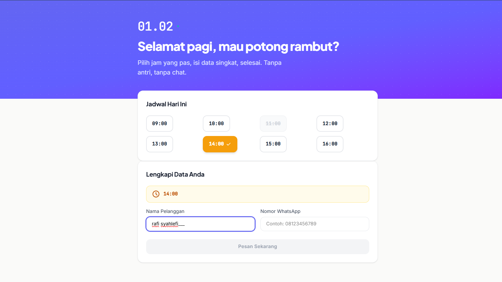

# BookEasy — Sistem Reservasi Jadwal untuk UMKM

Aplikasi web self-service untuk UMKM jasa (barbershop, salon, klinik kecantikan, studio foto, dll) agar pelanggan bisa booking jadwal secara online tanpa bolak-balik chat WhatsApp.



## Tentang BookEasy

Mayoritas UMKM jasa di Indonesia masih mengelola reservasi secara manual — buku catatan atau chat WhatsApp langsung. Model ini rentan terhadap **double-booking**, keterbatasan waktu respons admin, dan tidak ada jejak data terpusat.

BookEasy hadir sebagai solusi: pelanggan bisa melihat ketersediaan slot secara real-time, memilih jam yang tersedia, mengisi nama dan nomor WhatsApp, lalu konfirmasi booking — **tanpa perlu login atau registrasi**. Di sisi backend, sistem mencegah double-booking menggunakan database transaction dan locking.

Aplikasi ini juga terintegrasi dengan **WhatsApp** untuk mengirim notifikasi konfirmasi booking dan reminder otomatis ke pelanggan.

## Fitur Utama

- **Slot Availability Grid** — Grid jadwal real-time dari database, menampilkan status "Tersedia" dan "Penuh"
- **Guest Checkout** — Booking tanpa login/registrasi, cukup isi nama dan nomor WhatsApp
- **Server-Side Validation** — Validasi di backend menggunakan Laravel Form Request
- **Race Condition Protection** — `DB::transaction()` + `lockForUpdate()` mencegah double-booking
- **Auto-Refresh UI** — Grid jadwal ter-update otomatis setelah booking
- **Admin Authentication** — Login admin dengan Laravel Sanctum
- **Admin Dashboard** — Daftar booking hari ini
- **Manajemen Jadwal** — Atur jam operasional per hari (Senin-Minggu)
- **Manajemen Hari Libur** — Tandai tanggal yang tidak beroperasi
- **WhatsApp Notifikasi** — Integrasi Fonnte WhatsApp Business API

## Tech Stack

| Layer | Teknologi |
|-------|-----------|
| Backend | Laravel 13.x (REST API, PHP 8.3) |
| Frontend | Vue 3.5 + TypeScript + Vite 8 + Tailwind CSS 4 |
| Database | PostgreSQL (Supabase) |
| Auth | Laravel Sanctum (token-based, untuk admin) |
| WhatsApp API | Fonnte |
| Testing Backend | Pest PHP 4.x |
| Testing Frontend | Vitest + Vue Testing Library |

## Struktur Project

```
bookeasy/
├── backend/          # Laravel REST API
│   ├── app/
│   │   ├── Http/Controllers/
│   │   ├── Models/
│   │   └── Services/
│   ├── database/
│   ├── routes/
│   └── tests/
├── frontend/         # Vue.js SPA
│   ├── src/
│   │   ├── components/
│   │   └── services/
│   └── ...
├── Ravy/             # Dokumentasi perencanaan (PRD, Architecture, Design System)
└── README.md
```

## Quick Start

### Prasyarat

- PHP 8.3+ & Composer
- PostgreSQL (atau Supabase)
- Node.js 18+ & npm

### 1. Setup Backend

```bash
cd backend
cp .env.example .env
```

Edit `.env`, isi koneksi database:

```
DB_CONNECTION=pgsql
DB_HOST=127.0.0.1
DB_PORT=5432
DB_DATABASE=bookeasy
DB_USERNAME=
DB_PASSWORD=
```

Lalu jalankan:

```bash
composer install
php artisan key:generate
php artisan migrate
php artisan serve
```

Backend jalan di `http://localhost:8000`.

### 2. Setup Frontend

```bash
cd frontend
npm install
npm run dev
```

Frontend jalan di `http://localhost:5173` dan otomatis terhubung ke backend.

### 3. Menjalankan Test

```bash
# Backend (dari folder backend/)
php artisan test

# Frontend (dari folder frontend/)
npm run test
```

## API Endpoints

| Method | Endpoint | Auth | Description |
|--------|----------|------|-------------|
| GET | `/api/health` | No | Health check |
| GET | `/api/bookings?date=YYYY-MM-DD` | No | Ambil daftar slot + status |
| POST | `/api/bookings` | No | Booking baru |
| POST | `/api/auth/login` | No | Admin login |
| POST | `/api/auth/logout` | Yes | Admin logout |
| GET | `/api/admin/dashboard` | Yes | Dashboard admin |
| GET | `/api/admin/schedules` | Yes | Jadwal operasional |
| PUT | `/api/admin/schedules` | Yes | Update jadwal |
| GET | `/api/admin/holidays` | Yes | Daftar hari libur |
| POST | `/api/admin/holidays` | Yes | Tambah hari libur |
| DELETE | `/api/admin/holidays/{date}` | Yes | Hapus hari libur |
| DELETE | `/api/admin/bookings/{id}` | Yes | Batalkan booking |

### Response Format

```json
// Sukses
{ "success": true, "data": { ... } }

// Error
{ "success": false, "message": "...", "errors": { ... } }
```

## Testing

### Backend (Pest PHP)

```
tests/
├── Feature/
│   ├── BookingApiTest.php      # Happy path, validation, conflict, concurrency
│   ├── AuthApiTest.php         # Login/logout, token validation
│   └── DashboardApiTest.php    # Auth, date filter, empty data
└── Unit/
    └── BookingServiceTest.php  # Double-booking prevention
```

Jalankan: `php artisan test`

### Frontend (Vitest)

```
src/components/__test__/
├── AdminLogin.test.ts         # Login admin
├── AdminDashboard.test.ts     # Dashboard admin
├── ScheduleManager.test.ts    # Manajemen jadwal
├── HolidayManager.test.ts     # Manajemen hari libur
├── ScheduleGrid.test.ts       # Grid ketersediaan slot
└── BookingForm.test.ts        # Form booking
```

Jalankan: `npm run test`

---

Dibuat oleh Rafi Isnanto Syahlefi — Proyek portofolio full-stack development.
